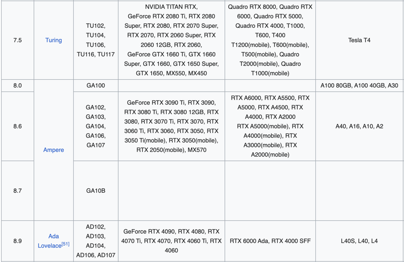

# XENGPUMiner-utils (Helper scripts for XENGPUMiner installation and monitoring)

> This repo aim to make it easier for people to install/monitor [shanhaicoder/XENGPUMiner](https://github.com/shanhaicoder/XENGPUMiner) and it does not modify nor alter the official XENGPUMiner code in any way.

### Assuming:

- You are renting on [vast.ai](https://vast.ai/) (This will most likely work outside Vast but some adjustment may be
  required depending on your setup)
- You are using `cuda:12.0.1-devel-ubuntu20.04` image or something equivalent (Debian-based system like Ubuntu)
- You have Nvidia driver and CUDA driver installed
  - To test both run `nvidia-smi` and `nvcc --version`
- You want to mine using every GPU available

> Most instances on Vast are sm_86 (86 => 8.6), but you can validate here [Wiki CUDA](https://en.wikipedia.org/wiki/CUDA) see `Compute Capability, GPU semiconductors and Nvidia GPU board products` section.

### Install software requirements and clone XENGPUMiner official repo

```shell
command -v sudo || apt install -y sudo git &> /dev/null && \
git clone https://github.com/samotpoint/XENGPUMiner-utils.git && \
cd XENGPUMiner-utils && \
sudo chmod -R 700 scripts && \
scripts/install.sh
```

### To start mining

```shell
scripts/start.sh && scripts/monitor.sh
```

> visit https://www.xenblocks.app/replace_this_with_your_account to monitor your instances (BETA)

### To manually test your setup

```shell
scripts/test.sh
```

### To stop mining

```shell
scripts/stop.sh
```

### To update the whole project to the latest version

> Automatically stop and restart everything after installation

```shell
scripts/reset.sh
```

### From Wiki CUDA

> 8.6 => sm_86


